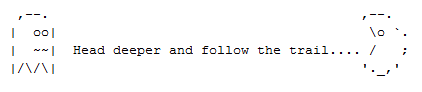

**Confusion - Misc (250)**

We recovered this file from a hacked android. See if you can find
anything in it.

Solves: 3

Author: @d3vnu11

The confusion.tar.gz file contained the following png-image:

Follow the trail is clearly a hint that there might be trailing bytes
after the PNG image end marker (IEND). 

	00000760   6E 80 2C 5E  1F 00 00 00  00 49 45 4E  44 AE 42 60  n.,^.....IEND.B`
	00000770   82 52 61 72  21 1A 07 01  00 00 00 00  00 00 00 00  .Rar!...........
	00000780   00 C6 CE 3E  07 20 16 75  0F C1 7C 6E  82 77 83 BF  ...>. .u..|n.w..
	00000790   14 90 F0 C3  57 AB B2 8A  FF 76 E2 C0  44 A6 36 D7  ....W....v..D.6.
	000007A0   5C 78 78 66  81 4D DF D2  6C C6 36 ED  B4 C8 28 43  \xxf.M..l.6...(C
	000007B0   7B C9 64 CD  1F 6F 22 46  74 BB FA E1  66 A9 59 81  {.d..o"Ft...f.Y.
	000007C0   0A 3E D7 27  03 DE 0E A6  CB E5 A5 30  10 10 5B 63  .>.'.......0..[c
	000007D0   25 50 44 46  00 00 00 00  00 00 00 00  00 00 00 00  %PDF............
	000007E0   FF FF FF FF  FF FF 00 00  FF 00 00 FF  00 FF 00 00  ................
	000007F0   00 00 B4 81  21 21 00 00  31 33 33 37  2E 70 64 66  ....!!..1337.pdf
	00000800   C6 CE 3E 07  20 16 75 0F  C1 7C 6E 82  77 83 BF 14  ..>. .u..|n.w...
	00000810   90 F0 C3 57  AB B2 8A FF  76 E2 C0 44  A6 36 D7 5C  ...W....v..D.6.\
	00000820   78 78 66 81  4D DF D2 6C  C6 36 ED B4  C8 28 43 7B  xxf.M..l.6...(C{
	00000830   C9 64 CD 1F  6F 22 46 74  BB FA E1 66  A9 59 81 0A  .d..o"Ft...f.Y..
	00000840   3E D7 27 03  DE 0E A6 CB  E5 A5 30 10  10 5B 63 E9  >.'.......0..[c.
	00000850   47 49 46 38  37 61 00 00  00 00 00 00  00 00 00 00  GIF87a..........

The IEND marker can be found at offset 0x769 and there are numerous misleading
file signatures after the IEND marker (hence the *confusion*). A bit down
there is a hint:

	00000970   00 00 00 00  00 00 00 00  00 00 00 00  80 00 57 59  ..............WY
	00000980   53 49 57 59  47 3A 20 44  6F 65 73 20  6E 6F 74 20  SIWYG: Does not
	00000990   63 6F 6D 70  75 74 65 2C  77 68 61 74  20 77 6F 75  compute,what wou
	000009A0   6C 64 20 50  68 69 6C 20  4B 61 74 7A  20 73 61 79  ld Phil Katz say

Phil Katz was the author of **PK**ZIP so I started looking for ZIP signatures.
There is no ZIP signature in there but then I created a test ZIP file with one file
zipped in it to investigate the structure. A bit into the header the filename is in
clear text followed by the letters UT and 0x09 hex (at least with the default zip 
parameters on Debian/Ubuntu). Then again near the end the filename + UT can be found,
this time followed by 0x05 hex.

	00000A70   E5 A5 30 10  10 5B 63 E9  69 8E A7 FF  D9 55 45 73  ..0..[c.i....UEs
	00000A80   3D 14 00 02  00 08 00 10  BE 1F 49 B1  A6 CA 52 A3  =.........I...R.
	00000A90   3E 00 00 EF  43 00 00 05  00 1C 00 2E  31 33 33 37  >...C.......1337
	00000AA0   55 54 09 00  03 B0 50 C7  57 6D F2 C9  57 75 78 0B  UT....P.Wm..Wux.
	
There it is, at 0x0A9B followed by UT + 0x09. So the file
name in the ZIP file should be **.1337**. Then the filename is
found again at 0x498C followed by UT + 0x05. But the
beginning of the ZIP header is missing.

Checking the ZIP documentation and my test file the fields
before the file name should be something like:

	Offs Len Descr
	0    4   Header signature = 50 4B 03 04
	4    2   Version needed to extract = 14 00
	6    2   General purpose bit flag
	8    2   Compression method = 08 00
	10   2   File last modification time
	12   2   File last modification date
	14   4   CRC-32
	18   4   Compressed size
	22   4   Uncompressed size
	26   2   File name length = 1C 00

Looking backwards from the file name the *1C 00* is there (at 0xA99),
*08 00* is also there (at 0xA85) and *14 00* (at 0xA81) is there. The
missing signature should start at **0xA7D** so I copied everything
from 0xA7D to a new file with dd:

	dd if=confusion.png of=carved.zip bs=1 skip=0xa7d

And inserted the 4 header signature bytes into carved.zip with hexedit.
But unzip fails with: *End-of-central-directory signature not found*.
It is certainly possible to fix that with hexedit, but I was in a hurry
and googled for ZIP repair tool instead and the first one worked
(diskinternals zip repair). File told me the extracted file .1337
was a PDF file so I renamed it [1337.pdf](1337.pdf).

	file .1337
	.1337: PDF document, version 1.4

Click the link above to download it. It contains the text
**So close......** and some garbage at the end. The garbage
is actually the flag, but written with some strange font.
You can just copy the garbage text in the PDF reader and
paste it somewhere to get the flag. I leave that as an
exercise to you.
