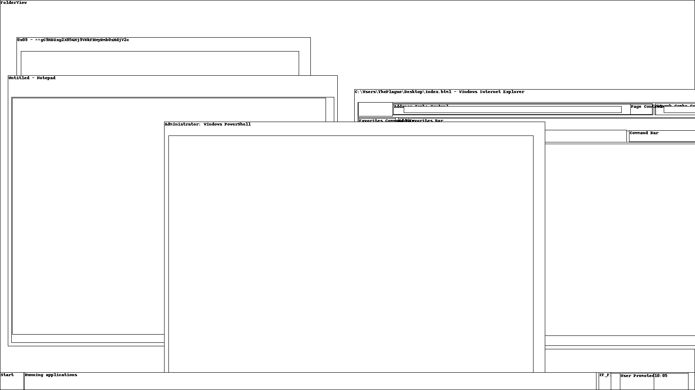

**Raid - Misc (300)**

Analyze this desktop memory dump we got from the raid last night. They were playing classic games as we broke in. 

[station.tar.gz](https://minfil.org/ybB9ofb9b0/station.tar.gz)

Solves: 13

Author: @d3vnu11


Upack station.tar.gz and you get a big file *Station* that looks like
a memory dump and they can usually be solved with a little help from
[volatility](http://www.volatilityfoundation.org/). I am not very
familiar with volatility but quickly found some commands using goggle:

```
volatility -f Station kdbgscan                                                                                                                                          
Volatility Foundation Volatility Framework 2.3.1
**************************************************
Instantiating KDBG using: Unnamed AS WinXPSP2x86 (5.1.0 32bit)
Offset (P)                    : 0x27f30a0
KDBG owner tag check          : True
Profile suggestion (KDBGHeader): Win7SP1x64
PsActiveProcessHead           : 0x2829b90
PsLoadedModuleList            : 0x2847e90
KernelBase                    : 0xfffff80002602000

**************************************************
Instantiating KDBG using: Unnamed AS WinXPSP2x86 (5.1.0 32bit)
Offset (P)                    : 0x27f30a0
KDBG owner tag check          : True
Profile suggestion (KDBGHeader): Win7SP0x64
PsActiveProcessHead           : 0x2829b90
PsLoadedModuleList            : 0x2847e90
KernelBase                    : 0xfffff80002602000

**************************************************
Instantiating KDBG using: Unnamed AS WinXPSP2x86 (5.1.0 32bit)
Offset (P)                    : 0x27f30a0
KDBG owner tag check          : True
Profile suggestion (KDBGHeader): Win2008R2SP1x64
PsActiveProcessHead           : 0x2829b90
PsLoadedModuleList            : 0x2847e90
KernelBase                    : 0xfffff80002602000

**************************************************
Instantiating KDBG using: Unnamed AS WinXPSP2x86 (5.1.0 32bit)
Offset (P)                    : 0x27f30a0
KDBG owner tag check          : True
Profile suggestion (KDBGHeader): Win2008R2SP0x64
PsActiveProcessHead           : 0x2829b90
PsLoadedModuleList            : 0x2847e90
KernelBase                    : 0xfffff80002602000
```

Volatility suggests a number of profiles but the pslist command below
only worked using the Win2008R2SP0x64 profile. Inserting the profile
argument into the same command I got:

```
volatility -f Station -f Station --profile=Win2008R2SP0x64 kdbgscan                                                                                                             
Volatility Foundation Volatility Framework 2.3.1
**************************************************
Instantiating KDBG using: Kernel AS Win2008R2SP0x64 (6.1.7600 64bit)
Offset (V)                    : 0xf800027f30a0
Offset (P)                    : 0x27f30a0
KDBG owner tag check          : True
Profile suggestion (KDBGHeader): Win7SP1x64
Version64                     : 0xf800027f3068 (Major: 15, Minor: 7601)
Service Pack (CmNtCSDVersion) : 1
Build string (NtBuildLab)     : 7601.17514.amd64fre.win7sp1_rtm.
PsActiveProcessHead           : 0xfffff80002829b90 (48 processes)
PsLoadedModuleList            : 0xfffff80002847e90 (134 modules)
KernelBase                    : 0xfffff80002602000 (Matches MZ: True)
Major (OptionalHeader)        : 6
Minor (OptionalHeader)        : 1
KPCR                          : 0xfffff800027f4d00 (CPU 0)
...
```

The offset is needed for the next commands. Pslist:

	volatility -f Station --profile=Win2008R2SP0x64 --kdbg 0xf800027f30a0 pslist > pslist.txt

That worked, we got a list of running processes in pslist.txt. So now
we know the profile and offset are correct. Then I tried a number of
commands and after a while I tried this command:

	mkdir screenshot
	volatility -f Station --profile=Win2008R2SP0x64 --kdbg 0xf800027f30a0  --dump-dir screenshot screenshot

That creates screenshots of the windows that were open when the memory
dump was taken. One of the screenshots was
session_2.WinSta0.Default.png:



One of the window titles looks like base64, but reversed. And it
is. echo 'window title' | rev | base64 -d gives the flag. Type in the
window title from the PNG above.
